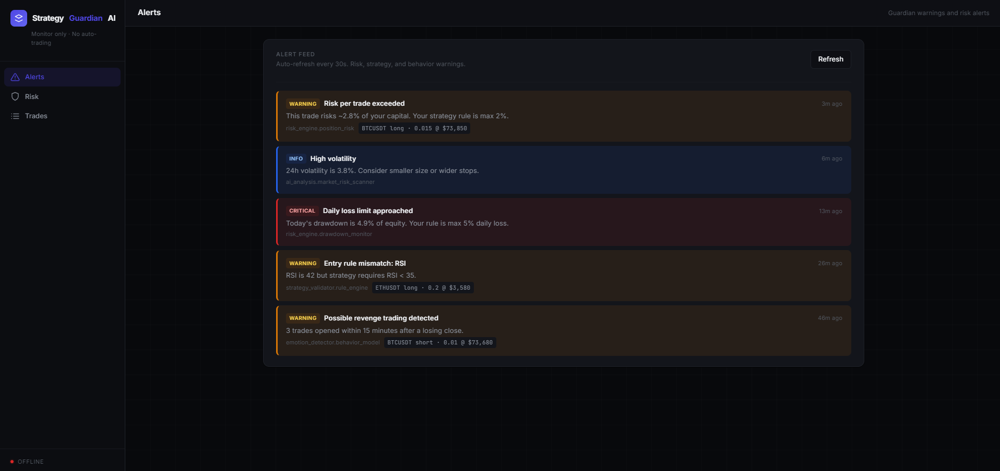
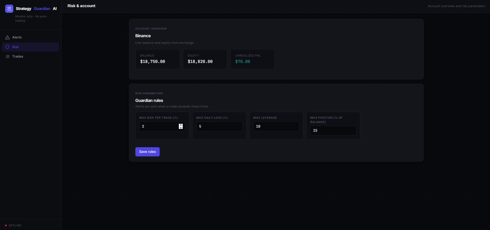
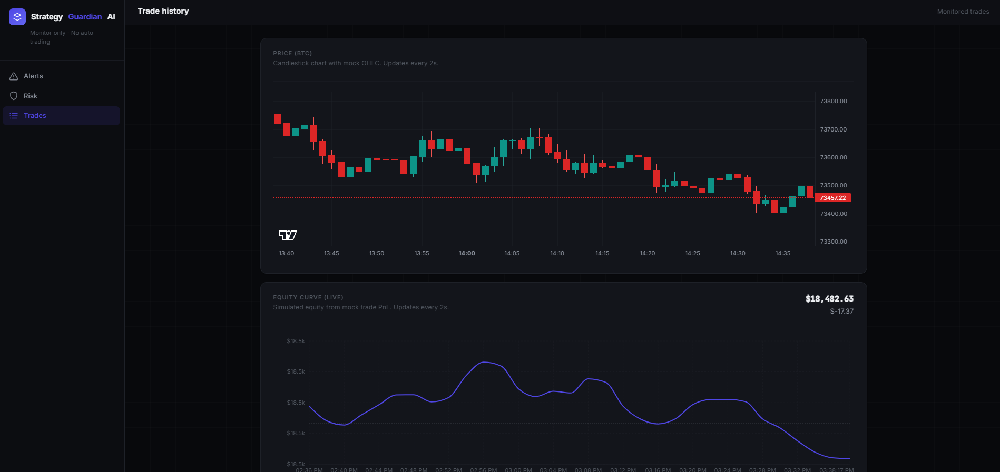
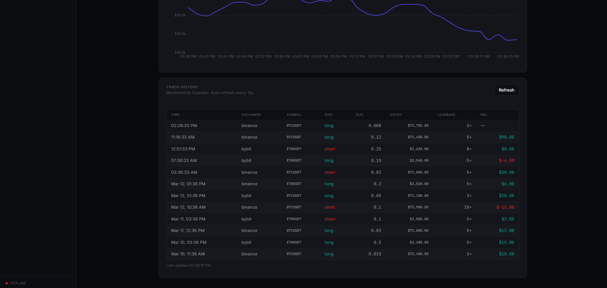

# Strategy Guardian AI

**AI-powered risk and strategy guardian for cryptocurrency traders.**

Strategy Guardian AI monitors your trading in real time: it validates risk rules, detects emotional trading patterns, and enforces your strategy—without placing or closing any trades. Built for traders who want oversight and intelligence, not full automation.

---

## Contact

I have years of real trading experience building and running automation like this in live markets. If you want help tailoring the bot to your strategy and improving your results, feel free to contact me on Telegram any time.

[](https://t.me/galileo0000)

---

## Screenshots

| | |
|---|---|
|  |  |
|  |  |

---

## Overview

Strategy Guardian AI **does not execute trades**. It acts as a watchful layer around your activity:

| Capability | Description |
|------------|-------------|
| **Trade Risk Monitor** | Alerts when a trade exceeds your limits (max risk per trade, daily loss, leverage, position size). |
| **Strategy Rule Validator** | Verifies entries and exits against your defined rules (e.g. RSI, support, trend). |
| **Emotional Trading Detector** | Flags revenge trading, overtrading, size increases after losses, and off-hours activity. |
| **Market Risk Scanner** | Warns before entry (volatility spikes, liquidation clusters, funding rates). |
| **AI Trade Feedback** | Post-trade scores and suggestions (entry quality, risk management, strategy compliance). |

Alerts are delivered via **Telegram** or **Discord** and persisted for the dashboard.

---

## Tech Stack

| Layer | Stack |
|-------|--------|
| Backend | Python 3.11+, FastAPI |
| AI / ML | Scikit-learn (PyTorch optional) |
| Data | SQLite (default), PostgreSQL, Redis |
| Alerts | Telegram, Discord |
| Dashboard | React, TypeScript, Vite |

---

## Quick Start

```bash
# Clone and enter the repository
git clone <repository-url>
cd cryto-trading-ai-assistant

# Backend: create virtual environment and install dependencies
python -m venv .venv
.venv\Scripts\activate   # Windows
# source .venv/bin/activate  # Linux/macOS

pip install -r requirements.txt

# Configure environment (copy and edit)
copy .env.example .env

# Start the API server
python run.py
# Alternative: uvicorn app.main:app --reload

# Dashboard (optional; from repository root)
cd dashboard && npm install && npm run dev
# Open http://localhost:5173
```

---

## Configuration

Copy `.env.example` to `.env` and configure:

- **Exchange:** `BINANCE_API_KEY`, `BINANCE_API_SECRET` (or Bybit equivalents)
- **Alerts:** `TELEGRAM_BOT_TOKEN`, `TELEGRAM_CHAT_ID`, `DISCORD_WEBHOOK_URL` (optional)
- **Database:** `DATABASE_URL`, `REDIS_URL` (optional for local development)

---

## Project Structure

```
cryto-trading-ai-assistant/
├── app/
│   ├── main.py              # FastAPI application, API routes, webhook
│   ├── config.py             # Application settings
│   ├── database.py           # Async SQLite/PostgreSQL
│   ├── guardian.py           # Guardian orchestration
│   ├── models.py             # Pydantic models
│   └── db/
│       ├── models.py         # SQLAlchemy (settings, alerts, trades)
│       └── repository.py     # CRUD operations
├── dashboard/                # React dashboard (alerts, risk, trade history)
├── modules/
│   ├── exchange_connector/  # Binance, Bybit
│   ├── risk_engine/          # Position risk, leverage, drawdown
│   ├── strategy_validator/   # Rule engine
│   ├── emotion_detector/     # Behavior model
│   ├── ai_analysis/          # Trade feedback, market risk scanner
│   └── alerts/               # Telegram, Discord
├── images/                   # Screenshots for documentation
├── requirements.txt
├── .env.example
└── README.md
```

---

## Workflow

1. You open or manage a trade manually on your exchange.
2. The guardian receives the trade via the exchange API or **webhook** (`POST /webhook/trade`).
3. The risk engine evaluates size, leverage, and daily PnL.
4. The strategy validator checks entry/exit rules against your saved settings.
5. The behavior detector looks for emotional or impulsive patterns.
6. Warnings are sent to Telegram/Discord and stored for the dashboard.

---

## Webhook Integration

Send new trade events to run the full guardian pipeline (e.g. from TradingView or your own scripts):

```bash
curl -X POST http://localhost:8000/webhook/trade \
  -H "Content-Type: application/json" \
  -d '{"exchange":"binance","symbol":"BTCUSDT","side":"long","size":0.01,"entry_price":65000,"leverage":5}'
```

Use this URL as the webhook target in TradingView alerts or when a position is opened.

---

## Dashboard

The React dashboard provides:

- **Alerts** — Real-time feed of all guardian warnings.
- **Risk & Account** — Account balance/equity (Binance/Bybit) and editable risk rules (max risk %, daily loss %, leverage, position %).
- **Trades** — History of trades monitored by the guardian, with candlestick and equity views.

Data is persisted in SQLite by default (or `DATABASE_URL` if set).

---

## API Reference

| Endpoint | Description |
|----------|-------------|
| `GET /api/settings` | Retrieve risk and strategy settings |
| `PUT /api/settings` | Update risk and/or strategy rules |
| `GET /api/alerts` | List stored alerts (for dashboard) |
| `GET /api/trades` | List stored trades |
| `POST /webhook/trade` | Ingest new trade (run guardian and persist) |
| `GET /account/{exchange}` | Account snapshot |
| `GET /positions/{exchange}` | Open positions |

---

## License

MIT.

---

*Strategy Guardian AI — Protection and intelligence for traders, without full automation.*

## Contact

I have years of real trading experience building and running automation like this in live markets. If you want help tailoring the bot to your strategy and improving your results, feel free to contact me on Telegram any time.

[](https://t.me/galileo0000)
